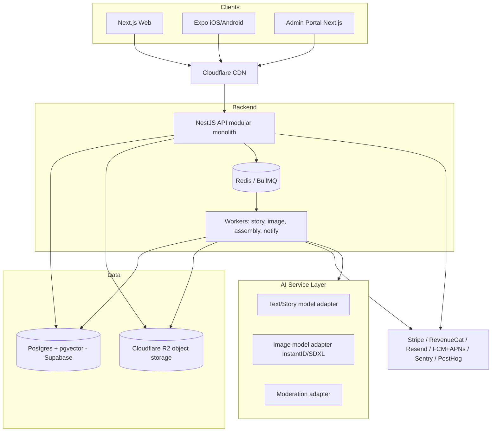
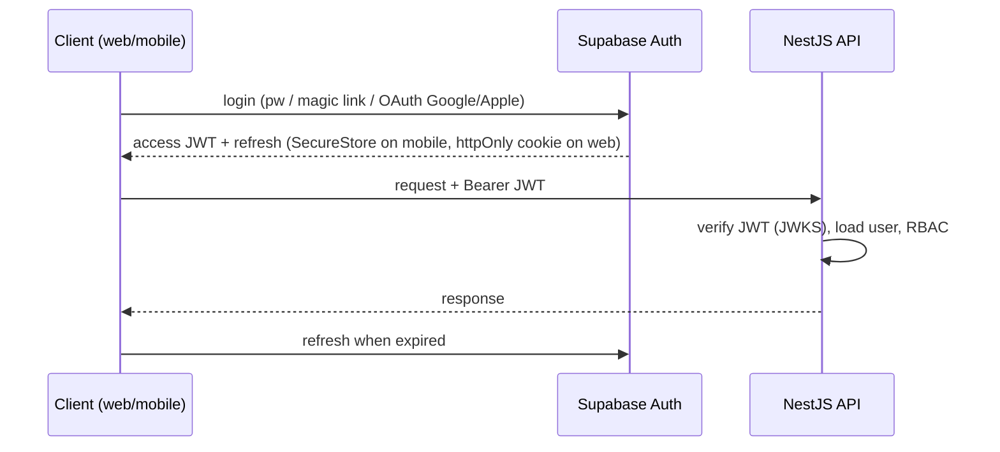
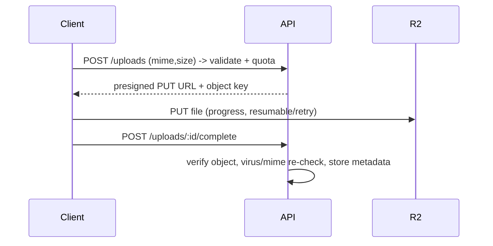
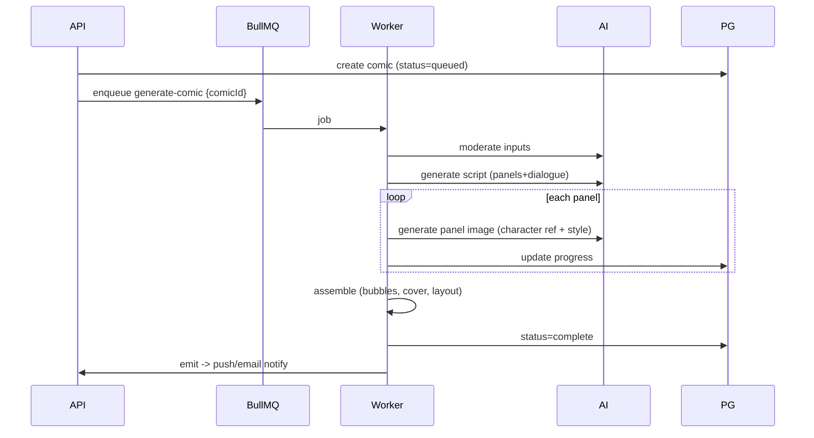
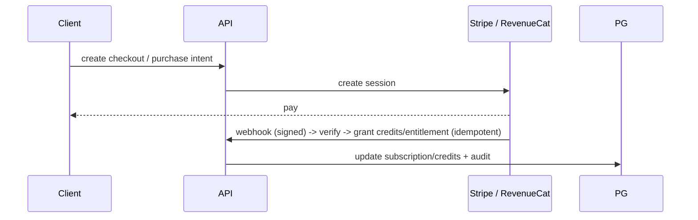
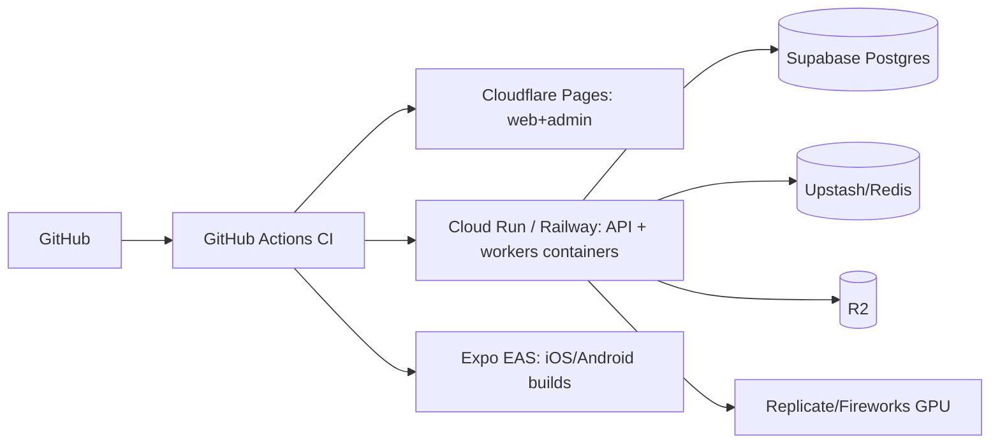

# StoryMe — Product Analysis & MVP Architecture

> Turn your photos into personalized comic stories. Upload a few photos → describe a
> story → pick an art style → get a shareable comic book in minutes.

---

## 1. Product Analysis

### Vision
Anyone can be the hero of a beautifully illustrated comic — their own face, their own
story, their own style — with no drawing skill and no wait longer than a coffee break.

### Target users
- **Parents** creating bedtime / birthday stories starring their child.
- **Friends** making funny gift comics.
- **Couples** turning shared memories into stories.
- **Pet owners / hobbyists** who want novelty creative content.

### User problems
- Personalized illustrated content is expensive (commissioned art) and slow.
- Generic AI image tools don't keep the *same character* consistent across panels.
- No easy "photo → finished, shareable comic" pipeline for non-designers.

### Core value proposition
**Character-consistent, personalized comics in minutes.** The differentiator is
identity preservation across every panel + a polished, shareable finished artifact
(cover, title, speech bubbles), not raw image generation.

### Primary use cases
1. Create a comic from photos + a text prompt + a chosen art style.
2. View / read a finished comic (paged reader).
3. Share a comic (public link, image/PDF export, social).
4. Buy credits / subscribe to generate more.
5. Regenerate or tweak a panel (post-MVP).

### User roles
| Role | Capabilities |
|---|---|
| **Guest** | View public/shared comics, marketing site. |
| **User** | Create characters, generate comics, manage account, billing. |
| **Admin** | Moderation, user management, refunds, feature flags, usage/cost dashboards. |
| **Support** (post-MVP) | Read-only user lookup + limited actions. |

### Business model & monetization
- **Freemium + credits.** Free tier: 1 short comic (e.g. 4 panels), watermarked.
- **Credit packs** (consumable) — pay per comic / per panel.
- **Subscription** tiers (Plus/Pro): monthly comic quota, no watermark, higher
  resolution, priority queue, more art styles.
- **One-off upsells:** printed comic book (print-on-demand, post-MVP), high-res export.
- Web via **Stripe**; mobile via **Apple IAP / Google Play Billing** (RevenueCat).

### Core user journeys
1. **Onboard → first comic:** sign up → upload 3–5 photos → name character → write
   story prompt → pick style → (pay/credit) → job runs → reader opens → share.
2. **Returning:** dashboard → reuse saved character → new story → generate.
3. **Billing:** hit quota → paywall → purchase → resume.

### MVP scope (in)
- Auth (email/pw, magic link, Google, Apple).
- Character creation from uploaded photos (identity embedding/reference set).
- Story generation: script (panels + dialogue) from user prompt.
- Panel image generation with **character consistency** + chosen style.
- Comic assembly: cover, title, speech bubbles, paged reader.
- Credits + one subscription tier; Stripe + IAP.
- Share link + image/PDF export.
- Web app + iOS + Android + admin portal.
- Content moderation on inputs and outputs.

### Post-MVP (recommended after launch)
- Panel regeneration / inline edit, custom speech-bubble editor.
- More styles, multi-character comics, longer comics.
- Print-on-demand, animated panels, TTS narration (bedtime mode).
- Referral program, gallery/community, templates.

### Required only at scale
- Dedicated GPU fleet + autoscaling, model routing/AB.
- Read replicas, partitioning, regional deployment, CDN image variants pipeline.
- Advanced fraud/abuse detection, dedicated moderation team tooling.

### Key assumptions
- ~1 comic = ~6–8 panels for MVP; each panel = 1 image gen.
- Character consistency achievable via SDXL + InstantID/IP-Adapter (identity ref)
  without per-user fine-tuning (LoRA) for MVP. (Validate in spike.)
- Users tolerate 1–5 min async generation with progress + push notification.
- Avg paying user generates a few comics/month.

### Unresolved questions
- Do we need per-user LoRA training (higher fidelity, higher cost/latency) or is
  InstantID/IP-Adapter "good enough"? → **decide via quality spike**.
- Price points & free-tier generosity (unit economics gate this).
- Print fulfillment partner (post-MVP).
- Minors' photos: parental consent flow depth for launch.

### Risks
- **Technical:** character consistency quality is the make-or-break; GPU cold starts;
  cost per comic variance.
- **AI:** likeness fidelity, style drift across panels, hands/faces artifacts,
  moderation false negatives/positives.
- **Privacy:** biometric/face data (BIPA/GDPR), children's images (COPPA/GDPR-K).
- **Security:** file-upload abuse, prompt injection into story gen, payment fraud,
  scraping of generated content.
- **Compliance:** GDPR/CCPA (DSAR, deletion, export), BIPA (Illinois biometric),
  COPPA (children), app-store content policies, PCI (offloaded to Stripe/stores).

### Success metrics
- Activation: % new users completing first comic.
- Time-to-first-comic (p50/p95).
- Comic completion rate (jobs succeeded / started).
- Character-likeness satisfaction (thumbs up / regen rate).
- Conversion to paid; ARPU; gross margin per comic (must be > 0).
- Retention (D7/D30), shares per comic (virality).

### MVP launch criteria
- End-to-end flow works on web + iOS + Android.
- Median comic likeness rated acceptable in internal eval set.
- Moderation blocks disallowed inputs/outputs.
- Payments + entitlements enforced server-side.
- p95 job success > 95%, cost per comic within target margin.
- Security review (OWASP), backups + restore tested, monitoring + alerts live.

---

## 2. Web & Mobile Feature Matrix

Legend: ✅ = present, — = n/a, `Admin` = admin portal.

| Feature | Classification | Web | Mobile | Admin |
|---|---|:--:|:--:|:--:|
| Marketing site / landing / pricing | MVP, Web only | ✅ | — | — |
| Sign up / login (email, magic link, Google, Apple) | MVP, Both | ✅ | ✅ | ✅ |
| Onboarding | MVP, Both | ✅ | ✅ | — |
| Dashboard (my comics) | MVP, Both | ✅ | ✅ | — |
| Upload photos (file picker) | MVP, Both | ✅ | ✅ | — |
| Camera capture | MVP, Mobile only | — | ✅ | — |
| Photo-library picker | MVP, Mobile only | — | ✅ | — |
| Create character | MVP, Both | ✅ | ✅ | — |
| Story prompt + style picker | MVP, Both | ✅ | ✅ | — |
| Generate comic (async job) | MVP, Both | ✅ | ✅ | — |
| Job progress / status | MVP, Both | ✅ | ✅ | — |
| Comic reader | MVP, Both | ✅ | ✅ | — |
| Share link | MVP, Both | ✅ | ✅ | — |
| Image/PDF export | MVP, Both | ✅ | ✅ | — |
| Push notification (job done) | MVP mobile; web via email/PWA | ◐ | ✅ | — |
| Credits / subscription purchase | MVP, Both | ✅ (Stripe) | ✅ (IAP) | — |
| Usage / quota display | MVP, Both | ✅ | ✅ | — |
| Account settings / profile | MVP, Both | ✅ | ✅ | — |
| Privacy settings / consent | MVP, Both | ✅ | ✅ | — |
| Data export (DSAR) | MVP, Both | ✅ | ✅ | — |
| Account deletion | MVP, Both | ✅ | ✅ | — |
| Activity history | Post-launch, Both | ✅ | ✅ | — |
| Help / support | MVP, Both | ✅ | ✅ | — |
| Deep links / universal links | MVP, Mobile only | — | ✅ | — |
| OTA updates | MVP, Mobile only | — | ✅ | — |
| Offline read cached comics | Post-launch, Mobile only | — | ✅ | — |
| Panel regenerate / edit | Post-launch, Both | ✅ | ✅ | — |
| User management / moderation | MVP, Admin only | — | — | ✅ |
| Cost & usage dashboards | MVP, Admin only | — | — | ✅ |
| Feature flags | MVP, Admin only | — | — | ✅ |
| Refunds / credit grants | MVP, Admin only | — | — | ✅ |
| Model/prompt config & eval | Post-launch, Admin only | — | — | ✅ |

---

## 3. High-Level Architecture (MVP = modular monolith + workers)

**Why modular monolith:** one deployable API with clear internal module
boundaries (auth, users, characters, comics, jobs, billing, admin). Background
workers are separate processes sharing the same codebase/packages. This gives
microservice-like isolation for the *expensive async work* (AI) without the ops
cost of many services. Migration path: any module (esp. AI orchestration) can be
extracted to its own service later with no client changes because contracts are
OpenAPI-defined.

### Auth flow

### File upload flow (direct-to-storage, presigned)

### AI processing / job flow

### Payment flow

### Deployment architecture

---

## 4. Technology Stack & Rationale

| Layer | Choice | Why / alternatives / trade-off / migration |
|---|---|---|
| Monorepo | Turborepo + pnpm | Fast, simple, TS-native. Alt: Nx (heavier), Bazel (overkill). |
| API | **NestJS (TS)** | Shares TS types with web/mobile; strong DI/module boundaries; OpenAPI native. Alt: FastAPI (Python) — better if ML in-process, but splits language & types. Since AI is hosted/offloaded, TS end-to-end wins on shared SDK + hiring. Migration: extract modules to services later. |
| Workers | BullMQ on Redis | Same TS codebase, mature, DLQ/retry/priority. Alt: Celery/Dramatiq (Python), QStash (serverless, good for low volume). Migration: swap Redis→managed, or QStash for spiky load. |
| DB | Postgres via **Supabase** | Free tier for beta, includes Auth+Storage+RLS; pgvector for identity/style embeddings. Alt: Neon (great branching, cheaper compute), Railway. Migration: standard Postgres → any managed PG or self-host. |
| Auth | **Supabase Auth** | Email/pw, magic link, Google, Apple, JWT verifiable everywhere. Alt: Better Auth (self-host, more control), Clerk (pricier), Keycloak (heavy). Migration: JWT/JWKS abstraction keeps swap cheap. |
| Storage | **Cloudflare R2** | Zero egress fees (huge for image-heavy), S3-compatible. Alt: Supabase Storage (simple, colocated), B2 (cheap), S3 (egress $$). Migration: S3 API compatible. |
| CDN | Cloudflare | Free, global, pairs with R2/Pages. |
| Web | Next.js 15 | SSR/SSG/RSC, SEO, image opt. |
| Mobile | Expo + RN | One codebase, OTA, EAS builds. Alt: Flutter (no TS sharing). |
| AI image | SDXL + InstantID/IP-Adapter | Character consistency without per-user training at MVP. Hosted on Replicate. Alt: FLUX (higher quality, pricier), per-user LoRA (best fidelity, costly). |
| AI text | Llama 3.3 / Qwen2.5 (hosted) | Cheap structured story gen. Fallback: GPT-4o-mini/Claude Haiku. |
| Payments | Stripe + RevenueCat | Web + unified mobile IAP. |
| Email | Resend | DX + generous free tier. Alt: SES (cheap at scale), Postmark (deliverability). |
| Push | Expo Notifications → FCM/APNs | Simplest RN path. |
| Analytics | PostHog | Product analytics + flags + session, self-hostable. |
| Errors/Obs | Sentry + OpenTelemetry | Crash + tracing; Better Stack/Grafana for logs/uptime. |
| Feature flags | PostHog / GrowthBook | Reuse PostHog. |

**Intentionally excluded:** Kafka, Kubernetes, microservices, GraphQL, dedicated
search engine, self-hosted GPU (at MVP) — each adds ops cost without MVP payoff.
