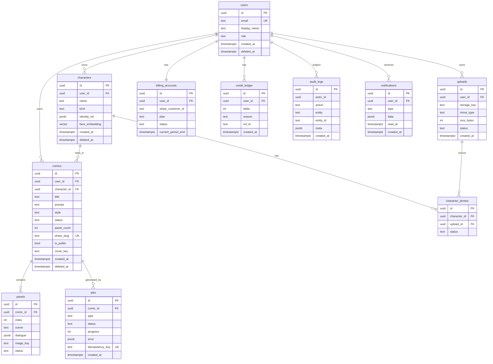

# StoryMe — Database Schema & API Design

## 1. ER diagram

## 2. Schema conventions
- **PKs:** `uuid` (`gen_random_uuid()`).
- **Audit fields:** `created_at`, `updated_at` (trigger), `deleted_at` (soft delete).
- **Soft delete** on `users`, `characters`, `comics`; hard-delete media on account
  deletion (GDPR) via cascade + storage cleanup job.
- **Tenant isolation:** every user-owned row has `user_id`; **RLS** policies enforce
  `user_id = auth.uid()`; service role bypasses for workers. Admin via role claim.
- **Indexes:** FK columns; `comics(user_id, created_at desc)`; `jobs(status, created_at)`
  (queue/monitoring); `comics(share_slug)` unique; `uploads(user_id, status)`;
  composite `credit_ledger(user_id, created_at)`. `pgvector` IVFFlat/HNSW on
  `characters.face_embedding` when similarity search added.
- **Check constraints:** `comics.status in (...)`, `panels.index >= 0`,
  `uploads.size_bytes <= max`, `credit_ledger.delta <> 0`.
- **Full-text search:** Postgres `tsvector` on comic title/prompt before adding
  Typesense/Meilisearch.
- **Retention:** temp uploads not attached to a character purged after 24–72h;
  failed jobs' partial images purged; soft-deleted rows purged after grace window.
- **Migrations:** SQL migrations via Drizzle/Prisma migrate (versioned, forward-only
  with expand/contract for zero-downtime). **Backups:** Supabase daily + PITR (Pro);
  test restore quarterly. **Pooling:** PgBouncer/Supabase pooler (transaction mode)
  for serverless workers.

## 3. Credits & entitlements (money-safe rules)
- Credits are **append-only ledger** (`credit_ledger`); balance = SUM(delta). Never
  mutate a balance column directly. Grants (purchase/subscription refill) and debits
  (comic generation) are ledger rows with `reason` + `ref_id`.
- Comic generation reserves credits **before** enqueue (idempotent by comic id);
  refunds credits on job failure (compensating ledger row).
- Webhooks are **idempotent** (store processed event ids).

## 4. Core API (REST, versioned `/v1`, OpenAPI-documented)

All auth via `Authorization: Bearer <JWT>`; mutations accept `Idempotency-Key`.
Standard error envelope: `{ error: { code, message, details? }, requestId }`.
Rate limits per-user + per-IP (stricter on auth, uploads, generation).

| Method | Route | Purpose | Auth | Notes |
|---|---|---|---|---|
| GET | `/v1/health` / `/v1/ready` | liveness/readiness | none | k8s/Cloud Run probes |
| POST | `/v1/auth/session` | exchange/refresh (delegated to Supabase) | public | — |
| GET | `/v1/me` | current user + entitlements + credit balance | user | — |
| PATCH | `/v1/me` | update profile/privacy | user | — |
| DELETE | `/v1/me` | request account deletion (DSAR) | user | async purge |
| GET | `/v1/me/export` | data export (DSAR) | user | async → link |
| POST | `/v1/uploads` | request presigned upload | user | validate mime/size/quota |
| POST | `/v1/uploads/:id/complete` | finalize + rescan | user | idempotent |
| GET | `/v1/characters` | list | user | RLS |
| POST | `/v1/characters` | create from uploads | user | — |
| GET | `/v1/characters/:id` | detail | user | — |
| DELETE | `/v1/characters/:id` | soft delete | user | — |
| GET | `/v1/comics` | list (paginated, filter) | user | — |
| POST | `/v1/comics` | create + enqueue generation | user | reserves credits, idempotent |
| GET | `/v1/comics/:id` | detail + panels + job status | user | — |
| GET | `/v1/comics/:id/status` | lightweight poll (or SSE) | user | progress |
| POST | `/v1/comics/:id/share` | toggle public + slug | user | — |
| GET | `/v1/comics/:id/export` | PDF/image bundle | user | async or streamed |
| GET | `/v1/public/comics/:slug` | shared comic | public | no PII |
| GET | `/v1/notifications` | list | user | — |
| POST | `/v1/notifications/register-device` | push token | user | SecureStore token |
| POST | `/v1/billing/checkout` | Stripe checkout session | user | web |
| POST | `/v1/billing/portal` | Stripe billing portal | user | web |
| GET | `/v1/billing/subscription` | entitlements | user | unifies Stripe+RC |
| POST | `/v1/webhooks/stripe` | Stripe events | signature | idempotent |
| POST | `/v1/webhooks/revenuecat` | mobile IAP events | signature | idempotent |
| GET | `/v1/admin/users` | list/search | admin | RBAC |
| GET | `/v1/admin/comics` | moderation queue | admin | — |
| POST | `/v1/admin/comics/:id/moderate` | approve/reject | admin | audit |
| POST | `/v1/admin/users/:id/credits` | grant/refund | admin | ledger + audit |
| GET | `/v1/admin/metrics` | usage/cost dashboards | admin | — |
| GET/PUT | `/v1/admin/flags` | feature flags | admin | — |

**Versioning:** URL `/v1`; additive changes non-breaking; breaking → `/v2` with
deprecation window. **SDKs:** OpenAPI → typed TS client generated into
`packages/api-client`, consumed by web, mobile, admin. **Idempotency:** stored keys
table; replays return the original response. **Audit:** all admin + billing +
deletion actions logged to `audit_logs`.
