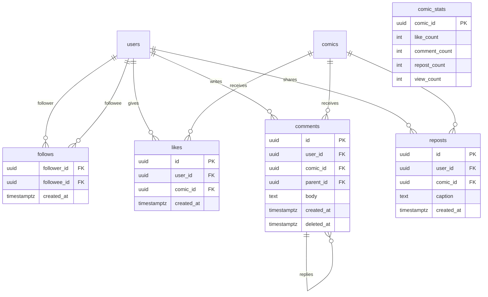

# StoryMe — Social Feed & Reels Extension

StoryMe is not just a generator — it's a **social network for personalized stories**.
Users publish their creations to a feed and others discover, like, comment, share, and
follow. This document extends the base architecture (docs 01–03) with the social graph
and the two story formats.

## 1. Story formats

A **Story** (implemented on the `comics` table via a `format` column) is one of:

| Format | Structure | Rendering | Reader UX |
|---|---|---|---|
| **Book** | 1–10 **pages**; each page holds 1–N panels with speech bubbles | Static images (WebP) per page + cover | Paged/swipe reader (web + mobile) |
| **Reel** | Ordered **frames** (panels) + timing + optional TTS narration/music | Short **vertical MP4** (9:16) assembled from frames with pan/zoom (Ken Burns) transitions | Full-screen autoplay vertical player, TikTok-style |

Both formats reuse the same generation pipeline (script → character-consistent panel
images). A **book** stops at image assembly; a **reel** adds a video-assembly step
(ffmpeg: frames + transitions + optional narration → MP4) in the worker.

- Reel narration (optional): open-source TTS (**Piper/Kokoro**) generates a voice track
  from the script captions; kept behind a feature flag for MVP.
- Reel video assembly runs in the `worker` via **ffmpeg** (already needed for exports).

## 2. Social domain model (additions)



Design notes:
- **`follows`** — directed edges; PK `(follower_id, followee_id)`; can't follow self
  (check constraint); index on both columns for "followers" and "following" queries.
- **`likes`** — unique `(user_id, comic_id)` (idempotent like/unlike).
- **`comments`** — self-referential `parent_id` for one-level threads (MVP: flat +
  single reply depth); soft-deletable; moderated.
- **`reposts`** — share-to-own-feed with optional caption (quote-repost).
- **`comic_stats`** — denormalized counters updated by triggers or the worker to avoid
  COUNT(*) on the hot feed path. Source of truth remains the base tables; counters are
  a cache, reconcilable by a scheduled job.
- Only `comics.is_public = true` (and moderation-approved) stories enter the feed.
- **Privacy:** private stories never appear in feed/search; blocked/muted users
  (post-MVP table `user_blocks`) filtered out.

## 3. Feed strategy

**MVP = fan-out-on-read (pull).** Feed is a query, not a materialized timeline:

```sql
-- Following feed (simplified)
SELECT c.* FROM comics c
JOIN follows f ON f.followee_id = c.user_id
WHERE f.follower_id = :me
  AND c.is_public AND c.status = 'complete' AND c.deleted_at IS NULL
ORDER BY c.published_at DESC
LIMIT :limit;  -- keyset pagination on (published_at, id)
```

Two feed surfaces:
- **Following** — stories from accounts you follow (query above).
- **Discover / For You** — public stories ranked by recency + engagement
  (`comic_stats`) + format diversity; MVP = simple recency + like-weighted score,
  cached in Redis per page for a short TTL.

**Why pull, not push (fan-out-on-write):** at MVP scale, per-follower timeline tables
are premature. Pull is simpler, always consistent, and cheap for modest graphs.
**Migration path (scale):** when top accounts have large follower counts and feed
reads dominate, move to **hybrid fan-out** — precompute timelines for active users,
keep pull for the long tail — without changing the client contract (same
`GET /v1/feed` endpoint).

Reels get their own vertical **`GET /v1/reels`** feed (public reels, autoplay order).

## 4. Social API (additions to docs/03)

| Method | Route | Purpose | Auth | Notes |
|---|---|---|---|---|
| GET | `/v1/feed` | following feed (keyset paginated) | user | cache-friendly |
| GET | `/v1/discover` | for-you / discover feed | user/public | ranked, Redis-cached |
| GET | `/v1/reels` | vertical reel feed | user/public | reels only |
| POST | `/v1/comics/:id/like` | like (idempotent) | user | 1 per user/comic |
| DELETE | `/v1/comics/:id/like` | unlike | user | — |
| GET | `/v1/comics/:id/comments` | list comments (paginated) | public if comic public | — |
| POST | `/v1/comics/:id/comments` | add comment | user | moderated, rate-limited |
| DELETE | `/v1/comments/:id` | delete own comment | user/admin | soft delete |
| POST | `/v1/comics/:id/repost` | repost to own feed | user | optional caption |
| POST | `/v1/comics/:id/view` | record a view | user/public | debounced, batched |
| POST | `/v1/users/:id/follow` | follow | user | not self |
| DELETE | `/v1/users/:id/follow` | unfollow | user | — |
| GET | `/v1/users/:id` | public profile + stats | public | no PII |
| GET | `/v1/users/:id/comics` | a user's public stories | public | — |
| GET | `/v1/users/:id/followers` / `/following` | social graph | public | paginated |
| GET | `/v1/notifications` | now includes like/comment/follow events | user | — |

**Rate limits:** likes/follows generous but capped (anti-spam); comments stricter +
content moderation; view events debounced client-side and batched server-side.

**Abuse & safety:** every public comic passes output moderation before feed eligibility;
comments moderated on write; report endpoint + admin moderation queue
(`POST /v1/comics/:id/report`, `POST /v1/comments/:id/report`); block/mute post-MVP.

## 5. Feature matrix additions

| Feature | Classification | Web | Mobile | Admin |
|---|---|:--:|:--:|:--:|
| Following feed | MVP, Both | ✅ | ✅ | — |
| Discover / For You feed | MVP, Both | ✅ | ✅ | — |
| Reels vertical player | MVP, Mobile-first (web supported) | ✅ | ✅ | — |
| Like / unlike | MVP, Both | ✅ | ✅ | — |
| Comment / reply | MVP, Both | ✅ | ✅ | — |
| Repost / share | MVP, Both | ✅ | ✅ | — |
| Follow / unfollow | MVP, Both | ✅ | ✅ | — |
| Public profile | MVP, Both | ✅ | ✅ | — |
| Social notifications | MVP, Both | ✅ | ✅ | — |
| Report content | MVP, Both | ✅ | ✅ | — |
| Moderation queue (posts + comments) | MVP, Admin only | — | — | ✅ |
| Block / mute | Post-launch, Both | ✅ | ✅ | — |
| Hashtags / topic search | Post-launch, Both | ✅ | ✅ | — |
| Hybrid fan-out timelines | At scale | — | — | — |

## 6. Cost / scale impact
- Feed reads are cheap DB queries at MVP; `comic_stats` avoids COUNT(*) hotspots.
- Reels add **video encoding** cost (ffmpeg CPU in worker + storage/CDN for MP4).
  Mitigate: cap reel length/resolution, encode once, serve via R2+CDN, lazy-generate
  reels only when a user chooses that format.
- Social tables are small rows, high count → index carefully; partition `likes`,
  `comments`, `views` only when volume demands (Phase 3 scaling).
- No new vendor lock-in: all social features are plain Postgres + Redis cache.
